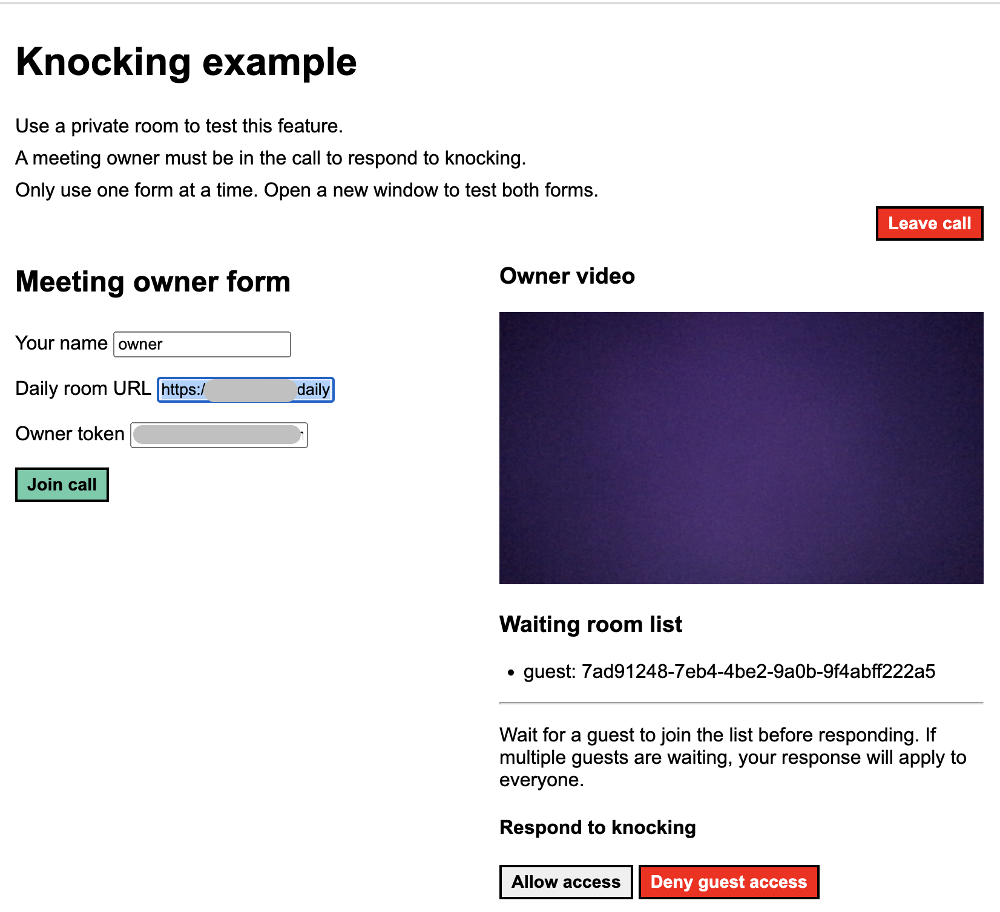
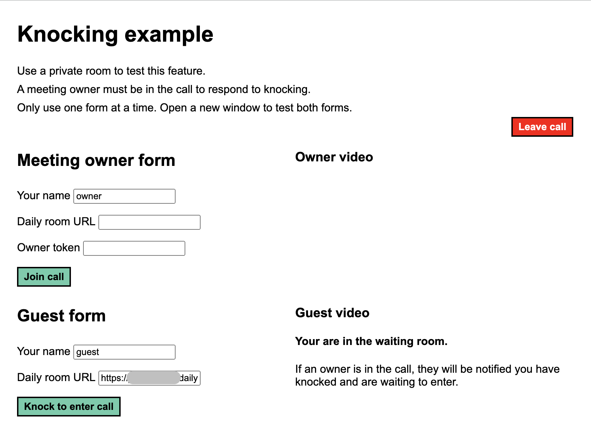

# Daily knocking demo

This is a basic demo app to showcase how to add a knocking feature to a custom Daily app built with [Daily’s client SDK for JavaScript](https://www.daily.co/products/video-sdk/). The knocking feature is the main focus, which means it does **not** include most of the events and methods required for a production-level video call, such as video and audio controls.

This demo consists of one JavaScript, HTML, and CSS file to avoid the reader requiring knowledge of a specific front-end framework. However, it is common for Daily custom video call UIs to be built with a front-end framework (such as React) to help manage app state more easily.

## Requirements

To use this demo, you will need:

1. A Daily account to create rooms and tokens. (There is a free tier.) https://dashboard.daily.co/signup
2. A private Daily room with [knocking](https://docs.daily.co/reference/rest-api/rooms/create-room#enable_knocking) enabled, which you can create in the [dashboard](https://dashboard.daily.co/rooms/create) or via the Daily REST API with the following cURL command. (Don't forget to replace `$DAILY_API_KEY` with your API key, found in the [dashboard](https://dashboard.daily.co/developers).)

```
curl -H "Content-Type: application/json" \
     -H "Authorization: Bearer $DAILY_API_KEY" \
     -XPOST -d \
     '{"name": "room-name",
       "privacy": "private",
       "properties" : {
          "enable_knocking":true}}' \
     https://api.daily.co/v1/rooms/

```

3. An owner meeting token, which you can create with the following cURL command:

```
curl -H "Content-Type: application/json" \
     -H "Authorization: Bearer $DAILY_API_KEY" \
     -XPOST -d '{"properties":
                  {"is_owner":true, "room_name":"room-name"}}' \
     https://api.daily.co/v1/meeting-tokens
```

**Note:** Your API key and meeting token should be stored securely. Never hard-code them in your app or commit them to the version control history.

## Run locally

To run this demo locally, start by cloning this repo locally and navigate to the repo's directory. Next, you can either:

- Open the `index.html` file in your browser, or;
- Run the following commands to start a local server:

```
npm install
npm run start
```

## How to use this demo

### Join as a meeting owner

Meeting owners can join private calls without knocking. When a guest knocks, owners can decide to let the guest into the call or reject their request.

To join as a meeting owner, fill out the _Meeting owner form_ with your name, the Daily room URL, and your token.



Once you join, you will see your video and a waiting room list. Guests that have knocked to join your call will show in the list. If there are guests awaiting, you can press the "Allow access" or "Deny guest access" buttons to let them in or reject them.

### Join as a guest

Guests can knock to join a private call when the [`enable_knocking`]() room setting is enabled.

To join as a guest, enter your name and the room URL in the _Guest form_.



## Additional resources

- Guide: [Controlling who joins a meeting](https://docs.daily.co/guides/configurations-and-settings/controlling-who-joins-a-meeting)
- Tutorial series: [Build a custom video call app with a prejoin UI](https://www.daily.co/blog/tag/daily-react-hooks/)
- Blog post: [Obtaining, handling, and validating meeting tokens in your video application](https://www.daily.co/blog/obtaining-handling-and-validating-meeting-tokens-in-your-video-application/)
- Blog post: [Creating video call rooms securely with Daily’s REST API](https://www.daily.co/blog/creating-video-call-rooms-securely-with-dailys-rest-api/)
- Blog post: [Comparing domain, room, and meeting token REST API configurations for Daily calls](https://www.daily.co/blog/comparing-domain-room-and-meeting-token-rest-api-configurations-for-daily-video-calls/)